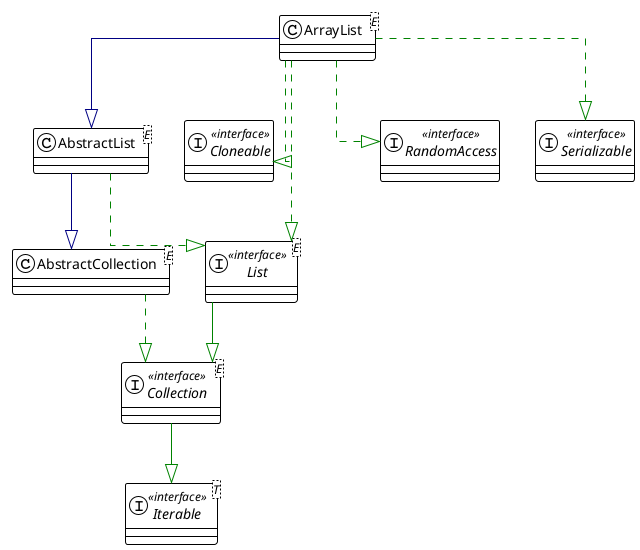

```plantuml
@startuml

!theme plain
skinparam linetype ortho

class AbstractCollection<E>
class AbstractList<E>
class ArrayList<E>
interface Cloneable << interface >>
interface Collection<E> << interface >>
interface Iterable<T> << interface >>
interface List<E> << interface >>
interface RandomAccess << interface >>
interface Serializable << interface >>

AbstractCollection  -[#008200,dashed]-^  Collection         
AbstractList        -[#000082,plain]-^  AbstractCollection 
AbstractList        -[#008200,dashed]-^  List               
ArrayList           -[#000082,plain]-^  AbstractList       
ArrayList           -[#008200,dashed]-^  Cloneable          
ArrayList           -[#008200,dashed]-^  List               
ArrayList           -[#008200,dashed]-^  RandomAccess       
ArrayList           -[#008200,dashed]-^  Serializable       
Collection          -[#008200,plain]-^  Iterable           
List                -[#008200,plain]-^  Collection         
@enduml
```
