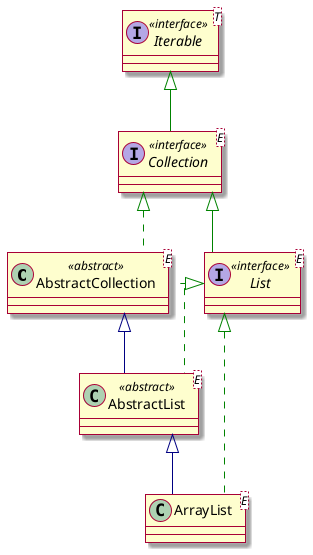

```plantuml
@startuml
skin rose
skinparam linetype ortho

class AbstractCollection<E> << abstract >>
class AbstractList<E> << abstract >>
class ArrayList<E>
interface Collection<E> << interface >>
interface Iterable<T> << interface >>
interface List<E> << interface >>

AbstractList <|-[#000082,plain]- ArrayList
AbstractCollection <|-[#000082,plain]- AbstractList
List <|.[#008200,dashed]. ArrayList
List <|-[#008200,dashed]- AbstractList
Collection <|-[#008200,plain]- List
Collection <|-[#008200,dashed]- AbstractCollection
Iterable <|-[#008200,plain]- Collection
@enduml
```

