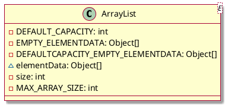

## 介绍


这些字段共同协作，使得`ArrayList`能够：
1. 高效启动：通过共享空数组和延迟初始化，减少创建时的开销。
2. 智能扩容：根据创建方式的不同 (`EMPTY`vs `DEFAULTCAPACITY_EMPTY`) 采用不同的首次扩容策略，平衡内存和性能。
3. 动态增长：通过 `size`和 `elementData`的配合，实现“动态数组”的行为。
4. 安全上限：通过 `MAX_ARRAY_SIZE`防止超出虚拟机限制。

## 字段说明

* **DEFAULT_CAPACITY**
```java
/**  
 * Default initial capacity.
 */  
private static final int DEFAULT_CAPACITY = 10;
```
* 含义：默认初始容量，`ArrayList`的默认初始容量。
	1. 使用无参构造函数`new ArrayList()`创建的空列表，在首次添加元素时，如果内部数组`elementData = DEFAULTCAPACITY_EMPTY_ELEMENTDATA`， 则会以此值为依据进行第一次扩容。
* 作用：智能扩容
	1. 它决定了“空白”`ArrayList`在开始增长时的初始大小。选择 10 是在内存占用和减少初始扩容频率之间做出的权衡。
***
* **EMPTY_ELEMENTDATA**
```java
/**
 * Shared empty array instance used for empty instances.
 */
private static final Object[] EMPTY_ELEMENTDATA = {};
```
* 含义：共享空数组实例，被用在指定初始容量为0的构造函数中，即`new ArrayList(0)`。
* 作用：内存优化，共享零容量实例。
	1. 标记作用：当`elementData == EMPTY_ELEMENTDATA`时，就意味着这个`ArrayList`是被明确指定以零容量开始的。
	2. 核心目的是优化内存。所有创建容量为0的`ArrayList`实例都共享这一个空数组对象，而不各自创建一个新的长度为0的数组，节省了不必须的内存开销。
***
* **DEFAULTCAPACITY_EMPTY_ELEMENTDATA**
```java
/**
 * Shared empty array instance used for default sized empty instances. We
 * distinguish this from EMPTY_ELEMENTDATA to know how much to inflate when
 * first element is added.
 */
private static final Object[] DEFAULTCAPACITY_EMPTY_ELEMENTDATA = {};
```
* 含义：共享空数组实例，被用在无参构造函数中，即`new ArrayList()`。
* 作用：延迟初始化优化，区分无参构造，为首次扩容提供特殊逻辑。
	1. 标记作用：当`elementData == DEFAULTCAPACITY_EMPTY_ELEMENTDATA`时，就意味着这个`ArrayList`是由无参构造方法创建的，首次扩容应该使用`DEFAULT_CAPACITY(10)`。
	2. JDK1.8引入的一个重要优化，目的是区分“无参构造”和“指定容量为0的构造”，它们在首次添加元素时逻辑不同，`DEFAULTCAPACITY_EMPTY_ELEMENTDATA`是一个“延迟初始化”的标记。
***
* **size**
```java
/**
 * The size of the ArrayList (the number of elements it contains).
 *  
 * @serial
 */
private int size;
```
* 含义：记录`ArrayList`实际包含的元素数量，即`list.size()`方法返回的值。
	1. 当 `size == elementData.length`时，表示数组已满下次添加将触发扩容。
* 作用：逻辑大小，用户直接感知的元素数量。
	1. 添加：新元素被放在 `elementData[size]`，然后 `size++`。
	2. 删除：移除元素后，后续元素前移，然后 `size--`。
***
* **elementData**
```java
/**  
 * The array buffer into which the elements of the ArrayList are stored.
 * The capacity of the ArrayList is the length of this array buffer. Any
 * empty ArrayList with elementData == DEFAULTCAPACITY_EMPTY_ELEMENTDATA
 * will be expanded to DEFAULT_CAPACITY when the first element is added.
 */
transient Object[] elementData; // non-private to simplify nested class access
```
* 含义：`ArrayList`的核心数组结构，用于存储所有元素的数组缓冲区。
* 作用：物理大小，实际占用的内存空间。
	1. 它的长度就是列表当前的容量而实际元素数量由 `size`字段记录。
	2. `ArrayList`的“动态扩容”本质就是创建更大容量的新数组，并替换`elementData`的引用。
	3. `transient`关键字表示数组不被序列化，只序列化实际包含的元素，而不是整个数组容量，以节省序列化后的空间。 
***
* **MAX_ARRAY_SIZE**
```java
/**
 * The maximum size of array to allocate.
 * Some VMs reserve some header words in an array.
 * Attempts to allocate larger arrays may result in
 * OutOfMemoryError: Requested array size exceeds VM limit
 */
private static final int MAX_ARRAY_SIZE = Integer.MAX_VALUE - 8;
```
* 含义：定义`ArrayList`内部数组理论上允许的最大容量。
* 作用：安全上限
	1. 值设为 `Integer.MAX_VALUE - 8`是因为在某些 JVM 实现中，数组对象需要一个固定的头部开销来存储元数据（如类型、长度）。减去 8 是为了给这个头部留出空间，避免超出 JVM 对数组大小的限制，从而避免潜在的 `OutOfMemoryError`。
	2. 这是一个安全上限。在 `grow()`扩容方法中，如果计算出的新容量超过此值，则会调用 `hugeCapacity()`方法进行最终裁决，在极端情况下（当所需最小容量已超过此值时）可能会直接扩容到 `Integer.MAX_VALUE`。